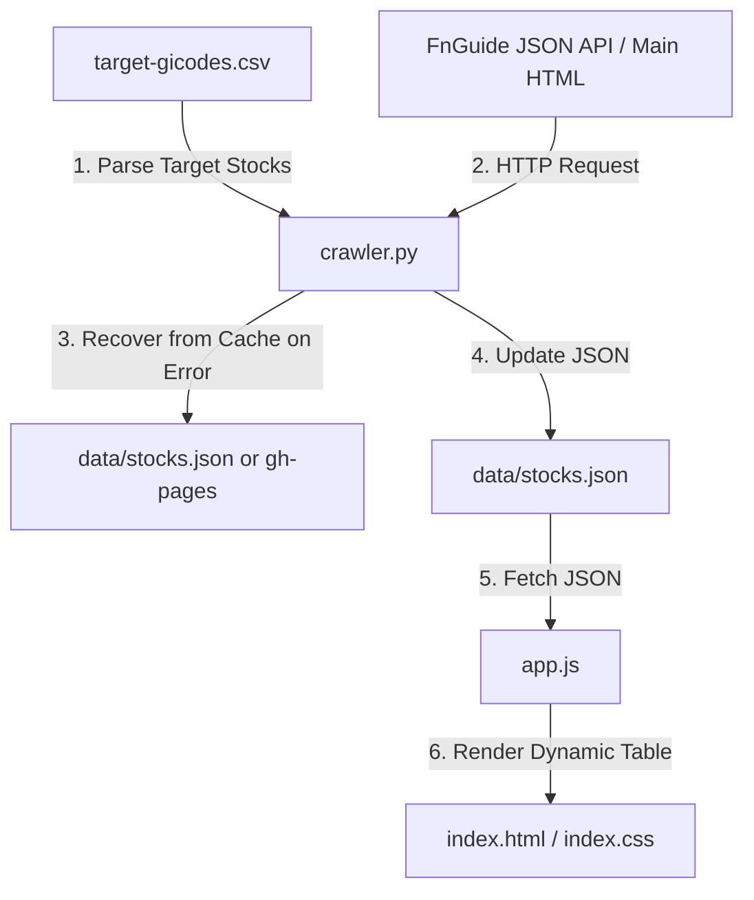

# AI Agent Instructions (AGENTS.md)

Safe guidelines for AI agents to maintain and extend the `stock-value-table` project.

## 1. Architecture & Data Flow

Serverless static web visualizing KRX stock data from FnGuide.

### Data Flow Diagram

### File Map

* [target-gicodes.csv](file:///Users/uno/Documents/github/stock-value-table/target-gicodes.csv): Input list of categories, company names, and stock codes (gicodes).
* [crawler.py](file:///Users/uno/Documents/github/stock-value-table/crawler.py): Python script that crawls FnGuide and outputs financial data JSON.
* [test_crawler.py](file:///Users/uno/Documents/github/stock-value-table/test_crawler.py): Unit and smoke tests for the crawler.
* [index.html](file:///Users/uno/Documents/github/stock-value-table/index.html): Web UI dashboard markup.
* [index.css](file:///Users/uno/Documents/github/stock-value-table/index.css): Glassmorphism stylesheet supporting dark/light themes.
* [app.js](file:///Users/uno/Documents/github/stock-value-table/app.js): Frontend script for data fetch, sorting, accordion, and scheduling theme transitions.
* [app.test.js](file:///Users/uno/Documents/github/stock-value-table/app.test.js): Vitest and JSDOM tests for frontend logic.
* [deploy.yml](file:///Users/uno/Documents/github/stock-value-table/.github/workflows/deploy.yml): GitHub Actions workflow for daily (16:30 KST) testing, crawling, and gh-pages deployment.

---

## 2. Backend Crawler Rules ([crawler.py](file:///Users/uno/Documents/github/stock-value-table/crawler.py))

### Connection Guidelines

* **Use JSON API**: Avoid parsing HTML tables in `SVD_Consensus.asp`. Fetch `https://comp.fnguide.com/SVO2/json/data/01_06/01_{gicode}_A_D.json` instead.
* **Extract Market Cap & Price**: Parse current price and market cap from `.us_table_ty1` on `SVD_Main.asp`.
* **Random Delay**: Insert `random.uniform(2.0, 3.0)` delay between requests to prevent IP blocking.

### Error Recovery & Safe Caching

* **Load Previous Cache**: On start, load local `data/stocks.json`. If missing, fetch from `gh-pages` branch (`https://raw.githubusercontent.com/{repo}/gh-pages/data/stocks.json`).
* **Partial Fail Recovery**: If crawling fails for a stock, do not remove it or crash. Recover the stock's previous data from cache, update its category, and keep it in the final dataset.
* **Job Summary**: Output execution success/failure counts to `GITHUB_STEP_SUMMARY` in Markdown.

---

## 3. Frontend UI & Theme Rules ([app.js](file:///Users/uno/Documents/github/stock-value-table/app.js))

### Rendering & Interaction

* **Category Tables**: Group stocks by `category`. Render separate tables with `h2.category-title` headers. Keep the CSV/JSON order of categories.
* **Sort Logic**: Toggle asc/desc sort on `th.sortable` using `localeCompare("ko")` on company names. Support keyboard input (Enter/Space) with `tabindex="0"`.
* **PER/PBR & Disparity Rate Highlights**: Use `isNegative()` helper for PER, PBR, and detail metrics to apply `.negative-color` CSS class (red text) if value starts with `-` (excluding solitary dashes). For `disparity_rate`, positive values ('저평가') indicate undervaluation: use `isUndervalued()` helper and apply `.undervalued-color` CSS class (golden amber text with `font-weight: 700`) to highlight undervalued stocks.
* **Accordion Animation**: Toggle `detail-row` on main row click or Enter/Space. Keep `display: none` and remove it 300ms after collapsing to match CSS grid transition. Control `aria-expanded` and `aria-controls`.

### Theme & Time Sync

* **System Automatic Mode**: When `system-theme-checkbox` is checked, switch theme to `dark` if time is between 20:00 and 07:00. Otherwise, use `light`.
* **Timer Management**: Schedule `setTimeout` for the next transition. Clear the timer immediately when switched to manual theme mode.
* **Focus Synchronization**: Force theme update on `visibilitychange` or `focus` when active.
* **Manual Override**: Saving manual themes to `manual-theme` in `localStorage`. Disable the theme toggle button if system theme is checked.

---

## 4. Testing & TDD Policies

### TDD Development Workflow

* **TDD Required**: All code development and bug fixes must be driven by Test-Driven Development (TDD).
* **TDD Skill Usage**: Utilize the `/tdd` slash command (the `tdd` skill) to execute the vertical slice red-green-refactor loop (One test -> Minimal implementation to pass -> Refactor -> Repeat).
* **Behavior Verification**: Test observable behavior through public interfaces, not implementation details, ensuring tests survive refactoring.
* **No Horizontal Slices**: Avoid writing tests in bulk. Implement and test one behavior increment at a time.

### Regression Prevention & Verification

* **Zero Regression**: New features must not introduce errors, bugs, or breaking changes to existing behaviors.
* **Regression Testing**: Verify regression safety by running the entire test suite and ensuring all existing tests pass.
* **Strict 100% Coverage**: Maintain exactly 100% code coverage for both backend and frontend. Every code change must be accompanied by passing tests.

### Python Crawler Tests ([test_crawler.py](file:///Users/uno/Documents/github/stock-value-table/test_crawler.py))

* **Strict Mocking**: Mock all external requests, delays, environment variables, and file I/O.
* **Smoke Testing**: Preserve `@pytest.mark.smoke` test (`test_crawl_stock_real()`) to check FnGuide API schema compliance.
* **Commands**:
  * Run all: `.venv/bin/pytest test_crawler.py -v`
  * Coverage: `.venv/bin/pytest --cov=crawler test_crawler.py --cov-report=json --cov-report=term:skip-covered`

### Frontend Tests ([app.test.js](file:///Users/uno/Documents/github/stock-value-table/app.test.js))

* **JSDOM Isolation**: Instantiate fresh JSDOM in `beforeEach` to reset document, localStorage, and window states.
* **Fake Timers**: Mock setTimeout using `vi.useFakeTimers()` and fast-forward with `vi.advanceTimersByTime()`.
* **Fetch Interception**: Intercept `fetch()` with mocked stock JSON. Test failure and empty states.
* **Commands**:
  * Run all: `npm run test`
  * Coverage: `npm run test:coverage`
